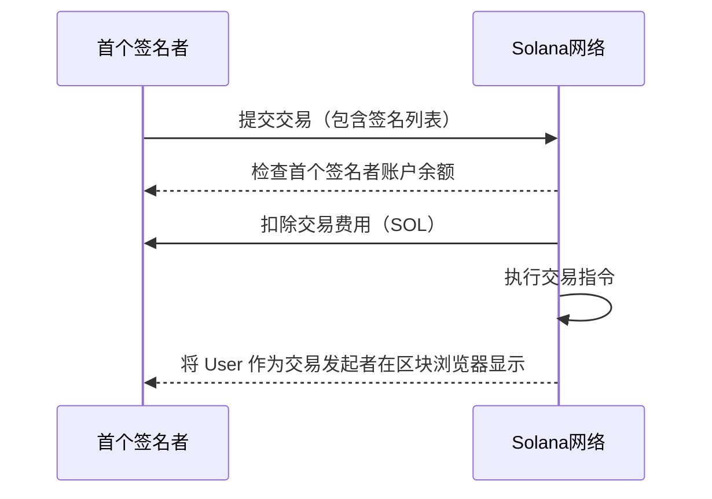

## 程序架构
```
传统转账：A → B (直接可见)
混币转账：A → 中间地址1 → 中间地址2 → ... → B (增强隐私)
```

## pda 签名
pda 账户生成算法  
```rust
let (pda, bump) = Pubkey::find_program_address(
    &[b"mix_intermediate", &seed_bytes, &layer_bytes],
    program_id,
);
```
pda invoke 交易
```rust
// 普通账户转账 (有私钥)
invoke(&instruction, &accounts)?;

// PDA 转账 (程序代理签名)
invoke_signed(&instruction, &accounts, &[&signer_seeds])?;
```


### Solana交易费用支付原理

在Solana区块链中，交易的**首个签名者**默认是交易费用的支付者。每个交易包含一个或多个签名，首个签名者（通常是发起交易的账户）负责支付交易费用（以SOL为单位），包括其中的 `CPI` 调用。





