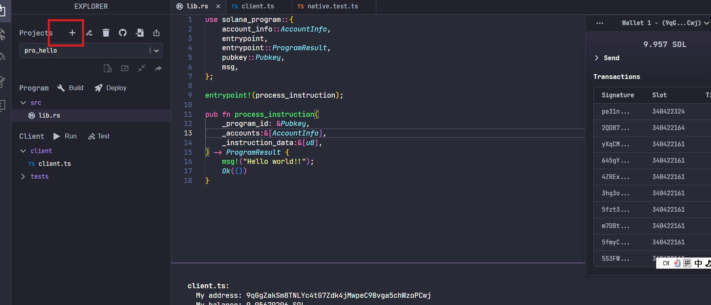
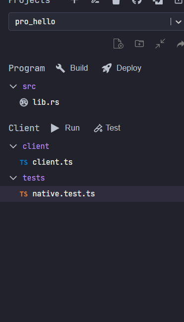
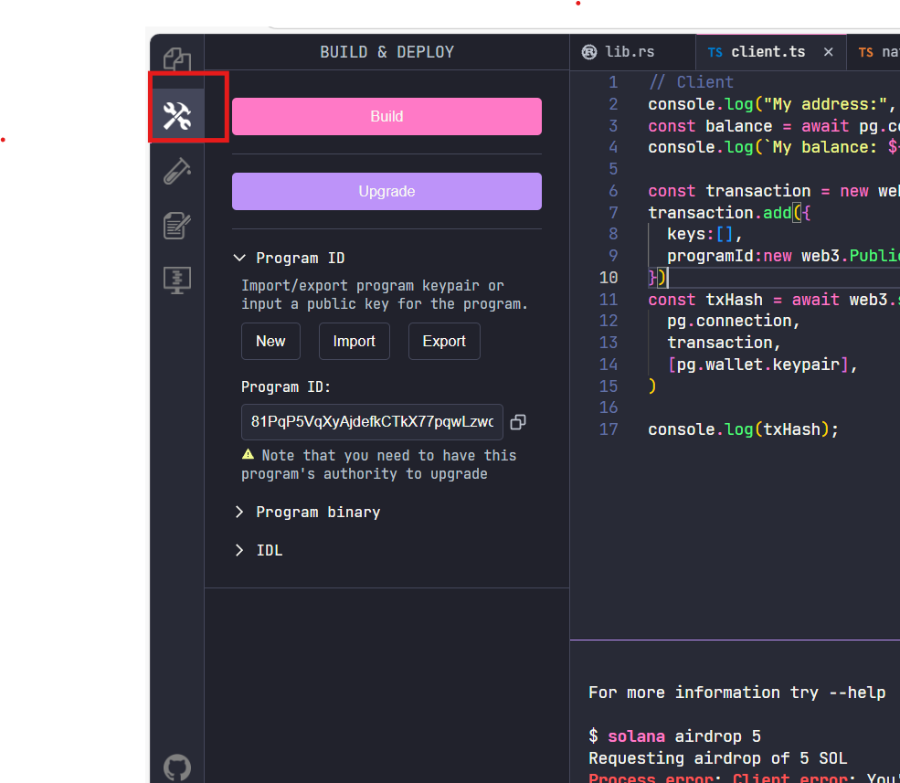
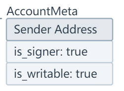
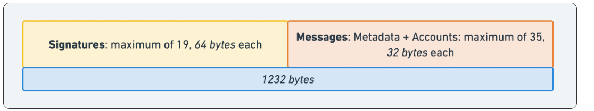
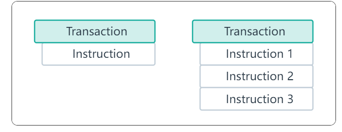
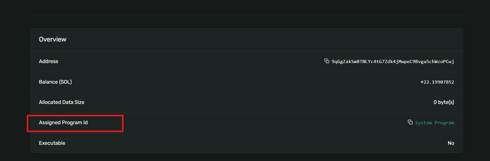

# Solana 学习笔记
Web3 开发者交流社群介绍​
📢 如果你也在研究区块链技术，特别是对 Solana 智能合约开发、区块链原理感兴趣，欢迎加入这个交流社群！我目前在制作相关的技术分享视频，在这里，我们可以一起讨论视频内容，分享学习心得。​
不管你是刚入门的小白，还是已经有一定经验的开发者，都能在这里畅所欲言。遇到技术难题，群友们可以互相帮忙出谋划策；有新的见解和发现，也能随时和大家交流。没有华丽的活动包装，就是一群热爱区块链技术的伙伴，踏踏实实学习、交流。​
📱 扫描下方社群二维码，就能直接入群。要是二维码失效了，添加我的微信（见下方微信二维码图片），备注【区块链学习】，我拉你进群，咱们一起在 Web3 的世界里探索进步！


## Solana 实现 Hello world
Solana 本地开发环境的搭建较为复杂，在初学阶段，推荐大家使用 [Solana Playgroud](https://beta.solpg.io/) 进行开发。上面有搭建好的 Solana 开发环境，并且提供了 Solana 工程的开发模板，易于初学者上手.  
  

打开界面后点击右上角的加号创建工程，并且在工程选项中选择 Native(Rust)，接下来便可以进入工程的开发。  
### 文件目录介绍
文件创建后，我们可以看到目录中有三个文件夹，分别是 src,client,tests. 其中 src 文件夹下存储了合约工程文件 lib.rs,用来编写我们的 Solana 智能合约逻辑。 client 文件夹下面存储了 client.ts 文件，为我们提供了一个与 Solana 网络交换的前端模板程序。最后的 test 文件夹下面存储了一个对 @solana/web3.js 中 API 功能的测试文件。




### 合约逻辑编辑
打开 src 文件夹下的 lib.rs 文件，我们清除掉 Solana Playground 给我们提供的初始模板，并贴入我们下面的 hello world 程序代码。  
 
```rust
use solana_program::{
    account_info::AccountInfo,
    entrypoint,
    entrypoint::ProgramResult,
    pubkey::Pubkey,
    msg,
};

entrypoint!(process_instruction);

pub fn process_instruction(
    _program_id: &Pubkey,
    _accounts:&[AccountInfo],
    _instruction_data:&[u8],
) -> ProgramResult {
    msg!("Hello world!!");
    Ok(())
}

```

完成代码后，我们点击界面左侧的 build & deploy 图标，之后对我们的工程进行 build，build 在控制台显示成功后，点击下方的 deploy 进行合约部署，这样我们就完成了一个Solana 智能合约在 devnet 网络上的部署



需要注意的是，部署合约需要 Solana 作为 gas ，如果账户内 Solana 不足的话，可以在命令行执行下面语句申请 Solana 空投

```shell
solana airdrop 2
```


### 前端文件改写
进入 client 下的 client.ts 文件夹。复制下面内容

```typescript
transaction.add({
  keys:[],
  programId:new web3.PublicKey(pg.PROGRAM_ID),
})
const txHash = await web3.sendAndConfirmTransaction(
  pg.connection,
  transaction,
  [pg.wallet.keypair],
)

console.log(txHash);
```


## Solana 实现访问计数器

### 合约逻辑
```rust
use borsh::{BorshSerialize,BorshDeserialize};
use solana_program::{
    account_info::{AccountInfo,next_account_info},
    pubkey::Pubkey,
    entrypoint::ProgramResult,
    entrypoint,
    msg,
    program_error::ProgramError
};

#[derive(BorshSerialize,BorshDeserialize)]
pub struct Counter {
    num:i32
}

entrypoint!(process_instruction);

pub fn process_instruction(
    program_id:&Pubkey,
    accounts:&[AccountInfo],
    _instruction_data:&[u8]
) -> ProgramResult {
    let account_iter = &mut accounts.iter();
    let account = next_account_info(account_iter)?;
    if account.owner != program_id {
        return Err(ProgramError::IncorrectProgramId)
    }
    let mut counter = Counter::try_from_slice(&account.data.borrow())?;
    counter.num += 1;
    counter.serialize(&mut *account.data.borrow_mut())?;
    msg!("{} access for {} times",account.key.to_string(),counter.num);
    Ok(())
    
}


```


### 前端交互和Solana的交易模型
#### 序列化规则设置
```typescript

class Counter {
  num:number
  constructor(fields:{num:number}|undefined=undefined) {
    if (fields) {
      this.num = fields.num;
    } 
  }
}

const Schema = new Map([
  [Counter,{kind:"struct",fields:[["num","u32"]]}]
])

const space = borsh.serialize(Schema,new Counter()).length
const lamports = await pg.connection.getMinimumBalanceForRentExemption(space);
const keypair = new web3.Keypair();


console.log("space = ",space)
console.log("lamports = ",lamports)

```


#### 一次计数的完成
```typescript

const createAccountTxIs = web3.SystemProgram.createAccount({
  fromPubkey:pg.wallet.publicKey,
  newAccountPubkey:keypair.publicKey,
  lamports,
  space:dataSize,
  programId:pg.PROGRAM_ID
});

const addTxIs = new web3.TransactionInstruction({
  keys:[
    {
      pubkey:keypair.publicKey,
      isSigner:false,
      isWritable:true
    }
  ],
  programId:pg.PROGRAM_ID
})

const tx = new web3.Transaction()
tx.add(createAccountTxIs,addTxIs);
const hash = await web3.sendAndConfirmTransaction(
  pg.connection,
  tx,
  [pg.wallet.keypair,keypair]
)


const tx1 = new web3.Transaction()
tx1.add({
  keys:[{
    pubkey:keypair.publicKey,
    isSigner:true,
    isWritable:true
  }],
  programId:pg.PROGRAM_ID
})
const hash1 = await web3.sendAndConfirmTransaction(pg.connection,tx1,[pg.wallet.keypair,keypair])

const rawCount = await pg.connection.getAccountInfo(keypair.publicKey)
const count = borsh.deserialize(
  Schema,
  Counter,
  rawCount.data
)


console.log("hash = ",hash1)
console.log(count)
console.log("counter.num = ",count.num)

```




AccountMeta 模型(来源: solana.com/docs)


#### 一笔交易下的多次计数
```typescript
class Counter {
  num:number
  constructor(fields:{num:number}|undefined=undefined) {
    if (fields) {
      this.num = fields.num;
    } 
  }
}

const Schema = new Map([
  [Counter,{kind:"struct",fields:[["num","u32"]]}]
])

const space = borsh.serialize(Schema,new Counter()).length
const lamports = await pg.connection.getMinimumBalanceForRentExemption(space)
const keypair = new web3.Keypair()

const tx = new web3.Transaction()

const createAccountTxIs = web3.SystemProgram.createAccount({
  fromPubkey:pg.wallet.publicKey,
  newAccountPubkey:keypair.publicKey,
  space,
  lamports,
  programId:pg.PROGRAM_ID
})

const txIs = new web3.TransactionInstruction({
  keys:[
    {pubkey:keypair.publicKey,isSigner:false,isWritable:false}
  ],
  programId:pg.PROGRAM_ID
})

tx.add(createAccountTxIs,txIs,txIs,txIs)

const txHash = await web3.sendAndConfirmTransaction(pg.connection,tx,[pg.wallet.keypair,keypair])
console.log("txHash = ",txHash)


let account = await pg.connection.getAccountInfo(keypair.publicKey)
const counter = borsh.deserialize(Schema,Counter,account.data);
console.log("counter.num = ",counter.num);

```


#### solana Transaction




transaction 结构(来源: solana.com/docs)




solana Instruction(来源: solana.com/docs)

```javascript
// web3.sendAndCofrimTransaction
async function sendAndConfirmTransaction(connection, transaction, signers, options) {
  const sendOptions = options && {
    skipPreflight: options.skipPreflight,
    preflightCommitment: options.preflightCommitment || options.commitment,
    maxRetries: options.maxRetries,
    minContextSlot: options.minContextSlot
  };
  const signature = await connection.sendTransaction(transaction, signers, sendOptions);
  let status;
  if (transaction.recentBlockhash != null && transaction.lastValidBlockHeight != null) {
    status = (await connection.confirmTransaction({
      abortSignal: options?.abortSignal,
      signature: signature,
      blockhash: transaction.recentBlockhash,
      lastValidBlockHeight: transaction.lastValidBlockHeight
    }, options && options.commitment)).value;
  } else if (transaction.minNonceContextSlot != null && transaction.nonceInfo != null) {
    const {
      nonceInstruction
    } = transaction.nonceInfo;
    const nonceAccountPubkey = nonceInstruction.keys[0].pubkey;
    status = (await connection.confirmTransaction({
      abortSignal: options?.abortSignal,
      minContextSlot: transaction.minNonceContextSlot,
      nonceAccountPubkey,
      nonceValue: transaction.nonceInfo.nonce,
      signature
    }, options && options.commitment)).value;
  } else {
    if (options?.abortSignal != null) {
      console.warn('sendAndConfirmTransaction(): A transaction with a deprecated confirmation strategy was ' + 'supplied along with an `abortSignal`. Only transactions having `lastValidBlockHeight` ' + 'or a combination of `nonceInfo` and `minNonceContextSlot` are abortable.');
    }
    status = (await connection.confirmTransaction(signature, options && options.commitment)).value;
  }
  if (status.err) {
    if (signature != null) {
      throw new SendTransactionError({
        action: 'send',
        signature: signature,
        transactionMessage: `Status: (${JSON.stringify(status)})`
      });
    }
    throw new Error(`Transaction ${signature} failed (${JSON.stringify(status)})`);
  }
  return signature;
}
```


```javascript
// 签名算法
sign(...signers) {
    if (signers.length === 0) {
      throw new Error('No signers');
    }

    // Dedupe signers
    const seen = new Set();
    const uniqueSigners = [];
    for (const signer of signers) {
      const key = signer.publicKey.toString();
      if (seen.has(key)) {
        continue;
      } else {
        seen.add(key);
        uniqueSigners.push(signer);
      }
    }
    this.signatures = uniqueSigners.map(signer => ({
      signature: null,
      publicKey: signer.publicKey
    }));
    const message = this._compile();
    this._partialSign(message, ...uniqueSigners);
  }
```

#### 多笔交易下的多次计数
```typescript
class Counter {
  num:number
  constructor(fields:{num:number}|undefined=undefined) {
    if (fields) {
      this.num = fields.num;
    } 
  }
}

const Schema = new Map([
  [Counter,{kind:"struct",fields:[["num","u32"]]}]
])

const space = borsh.serialize(Schema,new Counter()).length
const lamports = await pg.connection.getMinimumBalanceForRentExemption(space);
const keypair = pg.wallet.keypair;


console.log("space = ",space)
console.log("lamports = ",lamports)

const tx = new web3.Transaction()


const createAccountTxIs = web3.SystemProgram.createAccount({
  fromPubkey:pg.wallet.publicKey,
  newAccountPubkey:keypair.publicKey,
  space,
  lamports,
  programId:pg.PROGRAM_ID
})

const txIs = new web3.TransactionInstruction({
  keys:[
    {pubkey:keypair.publicKey,isSigner:false,isWritable:true}
  ],
  programId:pg.PROGRAM_ID
})

tx.add(createAccountTxIs,txIs,txIs,txIs)

const txHash = await web3.sendAndConfirmTransaction(pg.connection,tx,[pg.wallet.keypair,keypair])
console.log("txHash = ",txHash)

const tx1 = new web3.Transaction()
const txIs1 = new web3.TransactionInstruction({
  keys:[
    {pubkey:keypair.publicKey,isSigner:true,isWritable:true}
  ],
  programId:pg.PROGRAM_ID
})
const transferIs = web3.SystemProgram.transfer({
  fromPubkey:pg.wallet.keypair.publicKey,
  toPubkey:keypair.publicKey,
  lamports:web3.LAMPORTS_PER_SOL/2
})

tx1.add(txIs1,transferIs)

const txHash1 = await web3.sendAndConfirmTransaction(pg.connection,tx1,[pg.wallet.keypair,keypair])

console.log("pubkey = ",keypair.publicKey.toString());
console.log("txHash1 = ",txHash1)

const tx2 = new web3.Transaction()
tx2.add(txIs1)
const txHash2 = await web3.sendAndConfirmTransaction(pg.connection,tx2,[keypair])

let account = await pg.connection.getAccountInfo(keypair.publicKey)
const counter = borsh.deserialize(Schema,Counter,account.data);
console.log("counter.num = ",counter.num);


```

#### solana 账户所有权模型
solana 中任何账户都归某个合约所有，而不能独立存在。我们常用来交易的账户归 SystemProgram 所有，只有它才支持 Solana 的转账交易。当我们和某个合约(program)交互之前
必须先建立一个该合约所有的委托账户，通过委托账户才可以与该合约交互。

  
区块浏览器中账户所有权的展示


## rust 基本语法
[vs build](https://visualstudio.microsoft.com/zh-hans/downloads/?mode=dark)

[rustup download](https://www.rust-lang.org/zh-CN/tools/install)

### 类型推断
```rust
let a = 34;
let b:u8 = 12;
let c = "xxxx";
let d = String::from("xxxx");

```

### 可变修饰符
```rust
let age = 32;
// age = 23;  报错
let mut money = 100
let money = 220

```


### 引用
```rust
pub fn main() {
    let mut hobby1 = String::from("football");
    let hobby2 = &mut hobby1;
    // let hobby3 = &hobby1
    println!("hobby1 =  hobby2 = {} hobby3 = ",hobby2);
}
```

### 作用域
```rust
let animal1 = String::from("car");
{
    let animal2 = &animal1;
}
println!("animal2 = {}",animal);
```

### mod
### 同文件下的mod调用
```rust
mod sports {
    pub fn do_sports(s:String) {
        println!("I lke {}",s)
    }
}

sports::do_sports(String::from("ping-pong"));
```
### 不同文件下的mod调用
文件目录
- src
  - main.rs
  - college
    - mod.rs
    - student.rs


```rust
// mod.rs
pub mod student;
```
```rust
// student.rs
pub struct Student {
    pub name:String,
    pub age:u32
}

impl Student {
    pub fn new(name:String,age:u32) -> Student {
        Student {name:name,age:age}
    }

    pub fn show_msg(&self){
        println!("name {} age {}",self.name,self.age);
    }
}
```
```rust
// main.rs
pub fn main() {
  let s = college::student::Student::new(String::from("张三"),17);
  s.show_msg();
}
```

## 计数器合约中的 rust 语法
### 结构体
rust 可以定义字段和结构体方法，其是 rust 中面向对象编程的实现。
```rust
pub struct Student {
    name:String,
    age:u8,
    score:u32,
    absent_time:u32
}

impl Student{
    fn new(name:String,age:u8,score:u32) -> Self {
        Student{name:name,age:age,score:score, absent_time: 0 }
    }
    fn record(&mut self) {
        self.absent_time+=1
    }
}

pub mod Bank {
    pub struct Account {
        pub id:String,
        pub balance:u32
    }
    impl Account {
        pub fn new(id:String,balance:u32)->Self {
            Account{id:id,balance:balance}
        }
    }
}


fn main() {
    let mut s = Student::new("alice".to_string(), 20, 98);
    println!("name = {} age = {} score = {}",s.name,s.age,s.score);
    println!("absent before access = {}",s.absent_time);
    s.record();
    s.record();


    println!("absent before access = {}",s.absent_time);
    let account = Bank::Account::new("bob".to_string(), 100);
    println!("balance of {} is {}",account.id,account.balance)
}
```


## spl20 代币
### 原理讲解
 

